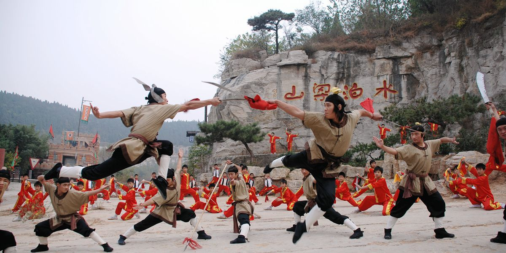

# life

## My hometown

I grew up in a small county called Liangshan located in the southwest of Shandong Province in China. There is nothing special about that place, so it is not a easy job for me to kick off a conversation using my hometown. When introducing my hometown to others, I only have two options to use:

1. Water Margin
2. Confucious

Option 1 is usually for Chinese since *Water Margin* is one of the four great classical novels of Chinese literature and its story occured at Liangshan, which most Chinese are aware of. 
{: style="height:500px;width:700px", align=left}[^1]
Option 2 is for non-Chinese, since some people may have heard about Confucious before and Liangshan is very close to Confucius's hometown. Confucious is one of the three figures sculpted on the east pediment of US supreme court, so I guess it is a big name in the western world. As a self-conscious person, I would say that it should at least be a average name, to compensate for the extra importance I put on figures from my own culture.  Based on the small amount of samples in my life, around 50% non-Chinese know about him, or at least pretend to know about him to avoid any potential social awkwardness :P { align=right}[^2] 

Although Liangshan has almost a million population, it is still a small town according to the Chinese standard. The geographical area that I am familiar with is even smaller. Most of my first 16 years were spent in a 5 by 5 matrix of blocks in Liangshan. But life was not boring at all. I had all I needed there. Home, families, relatives, schools, friends, shopping malls, basketball courts. The only long trips I needed to take are the visits to my maternal grandparents in Jinan around twice a year. 3-hour bus trips seemed really long back then. The tempo was slow, life was simple, and each day is fulfilling. 

## University Life

[^1]: https://www.theworldofchinese.com/2019/05/liangshan-the-mountains-and-the-marsh/
[^2]: https://www.caixinglobal.com/2021-10-02/weekend-long-read-what-a-minnesota-mural-of-confucius-tells-us-about-misinterpretation-101777253.html