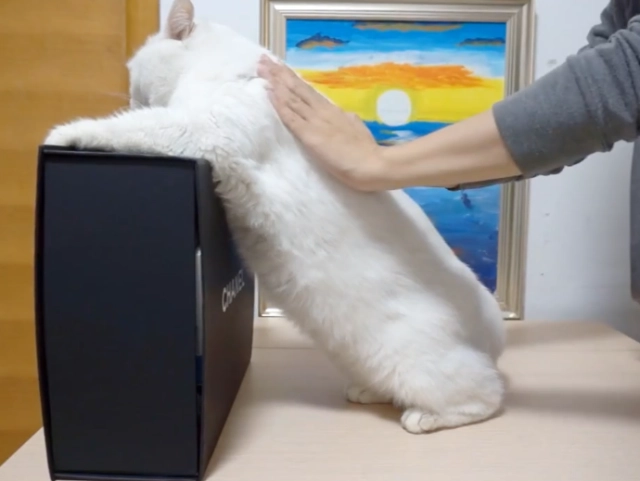

# My teaching philosophy

Below is a teaching philosophy I wrote before as a summary of my thoughts on effective classroom teaching. After a few years of teaching, my thoughts have changed a bit but most remain the same.  As French writer Jean-Baptiste Alphonse Karr said, "plus ça change, plus c'est la même chose" or "the more things change, the more they stay the same." Guess it is true.

----

## Teaching Philosophy

Teaching has a profound impact on the students and society, and it is a particularly challenging career in the era of online learning where students, who have easy access to massive online resources, may fail to place a high value on the traditional classes and lectures. In this teaching statement, I will briefly present my teaching philosophy developed over the years of teaching and learning experience in different subjects and levels, and briefly explain how the philosophy is reflected in my teaching practices.

### To inspire

In some fictional Chinese Wuxia Movies, the internal strength of a Kong-Fu master can be transferred to his disciple directly via physical connections of hands like data transmission between computers and USB flash drives. {: style="height:400px;width:400px", align=left} Obviously, yet sadly, knowledge cannot be passed that way. However, teaching may accidentally fall into this pit when teachers sometimes focus far too much on filling students' heads with content from mouth to ear, which can be quite ineffective since these raw materials may not be digestible and fail to become part of the students.   *Education is not the filling of a pail, but the lighting of a fire.*  I am not sure whether it actually comes from William Butler Yeats but it is true. A similar old Chinese saying also claims that *study originates from thinking, and thinking originates from questioning.* We need to treat the mind of students as wood to be kindled since inspiration arouses curiosity, and avid curiosity leads to motivation. Once the desire for truth is instilled into the mindset of the students, it will have a multiplier effect on the rest of teaching and learning: motivated students learn faster and deeper, and they retain their knowledge longer. When teaching computer science and information technology courses, the foremost important thing to teach is that computer science and information technology is fun and relevant. Not every student sitting in the classroom bears this state in mind, and it's the responsibility of the teacher to show both the interesting and the practical side of the course at the very beginning of the semester, or even at the very beginning of every class. For example, spam filters and sentiment analysis should be introduced before covering the related algorithmic solutions for text classification. Such examples provide context for the complicated methods introduced later and motivate the students for further investigation.  

### To solidify

I believe in the importance of frequent review of previously learned knowledge in teaching and learning. In practice, the teaching of every complicated skill or concept is broken down into multiple stages, and most course designs tend to use a linear approach where these steps are completed in sequential order. However, the shortcoming of this approach is obvious 
since it neglects the fact that people do forget things. {: style="height:400px;width:400px", align=right}[^2] Certainly midterm and final exams encourage students to review the subject every 2 months in a 4-month semester, but the 2-month gap is still a very long period considering the well-known *Ebbinghaus forgetting curve* [^1], which indicates that people forget things at an exponentially fast rate. To solve the problems above, I choose to incorporate some philosophies of *Agile software development* into my teaching philosophy. Agile software development is a spiral approach that is widely used in a software development life cycle (from the idea to the final product), and it advocates repeated iteration of the product.  In comparison, agile teaching involves frequent review, iteration, and practice of previously learned materials to  reinforce the memory and solidify the understanding, with each turn of the spiral adding new concepts to old. More often than not, previously learned knowledge can be understood from a different angle after familiarity of more advanced topics. *one can find what is new in reviewing what is old*. Confucius said this 2500 years ago, and it still applies to the teaching of today. 

### To engage.

Teaching should be engaging. All the other teaching philosophies would be meaningless if students lose their focus on the class. To this end, first, an active learning environment, specifically an inquiry-based learning atmosphere, needs to be fostered to get students involved during class time. By explicitly incorporating questions for the students in my lecture, students are encouraged to solve the puzzles themselves, and I can gauge their understanding of the material in real-time. Second, the routine of lectures should be broken up into different classroom activities, which is extremely important for a 3-hour class. Lectures, group discussions, quizzes, in-class labs/assignments, and student presentations are all possible flavors to be added to the course.  {: style="height:300px;width:400px", align=left}[^3]  Third, to keep a consistent pace and give students the time to process and digest the concepts, a bit-by-bit demonstration should be provided so students can feel that  they can safely become engaged in the material. Math theorem should be derived step by step and computer programs should be coded line by line. Last but not least, the application of information technologies in teaching can engage students both inside and outside the classroom. Online resources, including photos, videos, and animations, should be properly integrated into the classroom. The strength of online resources lies in their capability of visualizing and illustrating complex systems or relationships, which can further stimulate the interest among the students. Technologies like chat rooms or discussion forums provided by course management systems should also be embraced to facilitate discussion and collaboration outside the classroom. My experience has been that students of this generation are often excited about technologies and will participate actively in these activities.

Although the previous three paragraphs are at the core of my teaching philosophy,  every course should not be put into the same pedagogical box. The characteristics of each course  should be taken into consideration in the teaching practice. For example, the teaching of classes targeted at freshman students should focus more on critical thinking and learning habit cultivation.  At the same time, the requirements for assignments and projects should be extremely clear and detailed. On the contrary, in higher-level courses, the emphasis should be on collaboration, as complex scientific projects are rarely the work of an individual. Moreover, I found that relaxing constraints on how to handle assignments and conduct projects allows students to exhibit tremendous creativity. 

## Teaching Practices

Teaching philosophies need to be implemented and reflected in teaching practices. Besides the aforementioned methods for the purpose of philosophy explanation, some other methods are listed below, and these methods are commonly employed in my teaching to assist in knowledge transfer.

!!! note "Teaching Practices"

    1.**Flipped classroom model.**  In the flipped classroom model, students are required to complete the required materials like reading and video watching before the class of each week. In a flipped classroom, students can bring questions to the class, which makes the inquiry-based environment easier to be fostered. In addition, since less time needs to be spent on easy topics, more class time can be allocated to complicated concepts and other classroom activities that can contribute to an active learning environment.  
    
    2.**Polling students for understanding.** During the lecture, I regularly ask for feedback from students immediately after describing something complicated, for a quick show of hands. Free polling websites are also available if some students feel shy and are reluctant to raise their hands. I find the polling quite useful to make sure that no student is left behind. 

    3.**Multiple Learning Sprints.** Another teaching practice that can be borrowed from Agile software development is having more learning sprints in each course. Learning Sprint is a time-boxed effort (usually 1 to 3 weeks) in which students commit to achieving certain learning outcomes. In traditional teaching practice, the feedback loop is very long, with a half-semester or a full semester being the preferred unit of time for achieving learning outcomes. Nevertheless, providing students with frequent and early feedback is crucial to ensure that the students have a correct judgment of their own capability, avoiding the possible overestimation or underestimation of their competence. 
    
    4.**Including practice in class.** Practice makes perfect, which is sad but true, especially for computer programming courses where many principles can only be memorized through repetitive practice.  I always assign in-class labs/assignments to students so that they can exercise what they have just learned during that lecture, with help from me or other students at hand. By circulating through the class and interacting with the students during their exercises, I also get immediate feedback about the finished lecture and find out whether some topics are not properly delivered.

[^1]: Ebbinghaus, Hermann. Memory: A contribution to experimental psychology.} Annals of neurosciences 20.4 (2013): 155.

[^2]: https://www.mindtools.com/pages/article/forgetting-curve.htm

[^3]: https://media.giphy.com/media/BTYPaGRiUAwi9l0YLc/giphy.gif