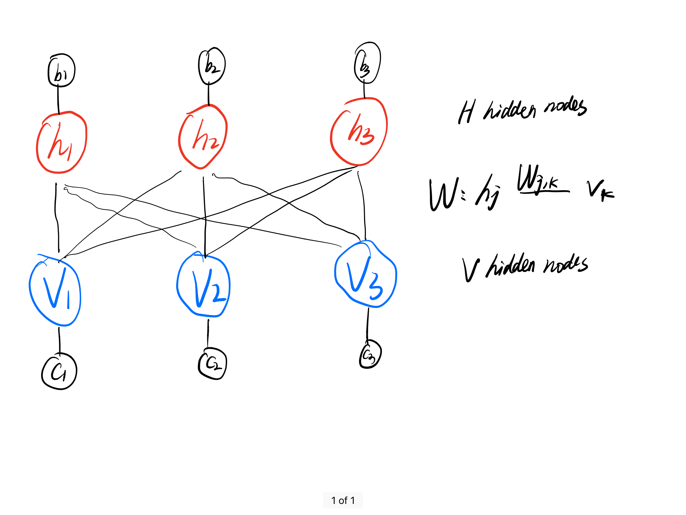

---
tags:
  - machine learning
  - generative model
  - Markov Chain Monte Carlo
  - Restricted Boltzmann Machine
  - Gibbs Sampling
  - Energy Model
  - Markov Random Field
comments: true

header-includes:
  - \usepackage{algorithm2e}


---

An introduction to Restricted Boltzmann Machine and Conditional Restricted Boltzmann Machine.


## Markov Chain Monte Carlo simulations for the Ising Model

### Ising Model

The Ising model is a formalized stochastic model of ferromagnet (i.e., an ordinary magnet) and is a $d$-dimensional lattice that can be denoted as the set below:

$$ I = \Big\{(x_1,x_2,\ldots,x_d)\in\mathbb{Z}^d: 1\leq x_l\leq L, l=1,2,\ldots,d\Big\}.$$

Each site can be considered as an iron atom if $I$ is an iron magnet. Specifically, a 2-dimensional Ising model contains $L^2$ sites which are evenly distributed in a square lattice. 

A *spin configuration* on $I$ is a function:

$$ \mathbf{\sigma}: I\xrightarrow{} \Big\{\pm 1\Big\} $$

which assigns a spin up (+1) or a spin down (-1) to each site in $I$.

*Hamiltonian* $\mathcal{H}(\mathbf{\sigma})$ is a function which specifies the total energy of a spin configuration. In the absence of an external magnetic field, it is defined as 

$$ \mathcal{H}(\mathbf{\sigma}) = - J \sum_{x,y}\sigma_x\sigma_y $$

where $J$ is the *coupling constant *, and $\sigma_x$ and $\sigma_y$ represent the spin of site $x$ and site $y$, respectively, and the summation is taken over all pairs of $(x,y)$ where site $x$ and $y$ are neighbours. Two sites are neighbours if exactly one coordinate of two sites differ by 1.

The probability of a spin configuration follows the *Boltzmann distribution*:

$$ p(\mathbf{\sigma})=\frac{1}{Z}\exp(-\frac{\mathcal{H}(\mathbf{\sigma})}{k_B T})$$

where $k_B$ is the Boltzmann constant and $T$ is the absolute temperature. $Z$ is a normalizing constant known as the \emph{partition function} and is defined as 


$$ Z = \sum_{\sigma}\exp(-\frac{\mathcal{H}(\mathbf{\sigma})}{k_B T}) $$


### Markov Chain Monte Carlo Simulations
The number of configuration in the Ising model is exponential of the number of sites, which makes the calculation of the normalizing constant $Z$ intractable for a large $L$. Therefore, we often study the Ising model using Monte Carlo simulations. If we could sample $N$ spin configurations from the Boltzmann distribution, then the expectation value of an observable $\mathcal{O}$ can be approximated by

$$ \mathbb{E}(\mathcal{O})=\frac{1}{N}\sum_{i}^N\mathcal{O}(\sigma^i) $$

where $\sigma^i$ is the $i_{\mathrm{th}}$ spin configuration sample. 

In spite of the computational intractability to compute the partition function $Z$, we can still sample the Boltzmann distribution using Markov Chain Monte Carlo (MCMC) techniques, specifically, *Metropolis Algorithm*, which is a special case of the *Metropolis-Hasting Algorithm*. For this specific problem, the algorithm goes like below:

!!! note "Metropolis Algorithm for Boltzmann Distribution"

    1. Initialize $\sigma^0$. A common practice is to independently and randomly assign +1 or -1 to each site.
    2. Randomly choose a site $x$.
    3. Let $\sigma^\prime$ be the spin configuration obtained by the flipping the spin at $x$ of the current spin configuration $\sigma$ , i.e., $\sigma_x^\prime=-\sigma_x$ and $\sigma_y^\prime=-\sigma_y$ for all $y\neq x$.
    4. Let $U_n$ be a standard uniform random variable. 
    5. If $U_n\leq \frac{p(\sigma^\prime)}{p(\sigma)}=\exp\Big(-\frac{\mathcal{H}(\sigma^\prime)-\mathcal{H}(\sigma)}{k_B T}\Big)$, then accept the spin flip and set $\sigma^{n+1}=\sigma^\prime$. Otherwise, reject the spin flip and set $\sigma^{n+1}=\sigma^n$.
    6. $n = n+1$ and return to Step 2. 

After we obtain a sequence of spin configurations, we will sub-sample those configurations every $\tau$ steps to make sure that the samples are i.i.d samples. The result of the sub-sampling will be a sequence of spin configurations that contain 

$$ \sigma^T, \sigma^{T+\tau}, \sigma^{T+2\tau},\ldots $$

where $T$ and $\tau$ are known as the \emph{burn-in period} and the \emph{sampling period}.

## Restricted Boltzmann Machine

A Restricted Boltzmann Machine (RBM) is a bipartite graph. The structure of a RBM that contains 3 hidden nodes and 3 visible nodes is illustrated below. 

<div class='rbm'>

</div>


In the following, we consider a RBM that contains $V$ visible nodes and $H$ hidden nodes, where every visible node is connected with every hidden node, with no connection among each layer. In this tutorial, we focus on Bernoulli RBM where the value of each node is either 0 or 1. 

RBM is a theoretical model inspired by statistical mechanics. In this model, the value of $\mathbf{v}=[v_1, v_2, \ldots, v_V]$ and $\mathbf{h}=[h_1, h_2, \ldots, h_H]$  satisfy Boltzmann (Gibbs) distribution, which claims that the probability of a system staying in a certain micro-state is the function of the system energy and the system temperature. For the RBM model, the probability distribution of $\mathbf{v}$ and $\mathbf{h}$ can be expressed as:


$$ p_{\theta}(\mathbf{v},\mathbf{h}) = \frac{1}{Z}\mathrm{exp}(-E(\mathbf{v},\mathbf{h})) $$

where $\theta=\{\mathbf{W},\mathbf{b},\mathbf{c}\}$, and the normalization constant $Z=\sum_{\mathbf{v},\mathbf{h}}\mathrm{exp}(-E(\mathbf{v},\mathbf{h}))$ is referred to as the \emph{partition function}, and $E(\mathbf{v},\mathbf{h})$ is the energy function calculated by 

$$ E(\mathbf{v},\mathbf{h}) = -\mathbf{h}^T\mathbf{W}\mathbf{v}-\mathbf{b}^T\mathbf{v}-\mathbf{c}^T\mathbf{h}
=-\sum_{j}\sum_k h_j W_{j,k} v_k - \sum_k b_kv_k - \sum_j c_j h_j
$$

where $\mathbf{c}$ and $\mathbf{b}$ are the visible and hidden bias terms, respectively. Note here that $Z$ is intractable to compute for a large RBM model. 


### Training
The first question that we need to ask is what the objective function is. We can look at this from two perspectives:
    
- Kullback-Leibler (K-L) Divergence 
- Maximum Likelihood


K-L divergence is a measurement of distance between two probability distributions. In RBM, we would like to minimize the K-L divergence between the unknown distribution of the training data $p_\mathbf{train}(\mathbf{v})$ and the distribution represented by the RBM $p_{\theta}(\mathbf{v})$:

$$ 
\begin{eqnarray}
&\textrm{KL}(p_\mathbf{train}\|p_\mathbf{\theta})&=\sum_{\mathbf{v}} \Big(p_\mathbf{train}(\mathbf{v})\log\frac{p_\mathbf{train}(\mathbf{v})}{p_\theta(\mathbf{v})}\Big) \nonumber \\
&&= \sum_{\mathbf{v}}p_\mathbf{train}(\mathbf{v})\log p_\mathbf{train}(\mathbf{v})-\sum_{\mathbf{v}}p_\mathbf{train}(\mathbf{v})\log p_\theta(\mathbf{v}) \nonumber \\
\end{eqnarray}
$$ 

So 

$$
\begin{eqnarray}
&\underset{\theta}{\min}~ \textrm{KL} &\Longleftrightarrow  \underset{\theta}{\max}\sum_{\mathbf{v}}p_\mathbf{train}(\mathbf{v})\log p_\theta(\mathbf{v}) \\
&&\nonumber \Longleftrightarrow \underset{\theta}{\max}\frac{1}{N}\sum_{\hat{\mathbf{v}_i}}\log p_\theta(\mathbf{\hat{v}_i})  ~\textrm{,}~ \hat{\mathbf{v}_i} ~\text{is a sample from}~ p_\mathbf{train}(\mathbf{\hat{v}})\\
&& \Longleftrightarrow\underset{\theta}{\max}\prod_{\hat{\mathbf{v}_i}}p_\theta(\hat{\mathbf{v}_i})
\end{eqnarray}
$$

So the minimization of the KL divergence is equivalent to the Maximum Likelihood. 

$$
\begin{eqnarray}
&p_\theta(\mathbf{v})&=\sum_{\mathbf{h}}p_{\theta}(\mathbf{v},\mathbf{h})\\
&\nonumber &=\sum_{\mathbf{h}}\frac{1}{Z}\exp(-E(\mathbf{v},\mathbf{h}))\\
&\nonumber &=\frac{1}{Z}\sum_{\mathbf{h}}\exp(\mathbf{h}^T\mathbf{W}\mathbf{v}+\mathbf{b}^T\mathbf{v}+\mathbf{c}^T\mathbf{h})\\
&\nonumber &=\frac{1}{Z}\exp(\mathbf{b}^T\mathbf{v})\sum_{\mathbf{h}}\exp(\mathbf{h}^T\mathbf{W}\mathbf{v}+\mathbf{c}^T\mathbf{h})\\
&\nonumber &=\frac{1}{Z}\exp(\mathbf{b}^T\mathbf{v})\sum_{\mathbf{h}}\exp(\sum_{j=1}^{H}(h_jW_{j,:}\mathbf{v}+c_jh_j))\\
&\nonumber &=\frac{1}{Z}\exp(\mathbf{b}^T\mathbf{v})\sum_{h_1\in\{0,1\}}\exp(h_1W_{1,:}\mathbf{v}+c_1h_1) ~\ldots~\sum_{h_H\in\{0,1\}} \exp(h_H W_{H,:}\mathbf{v}+c_H h_H)\\
&\nonumber &=\frac{1}{Z}\exp(\mathbf{b}^T\mathbf{v})\prod_j(1+\exp(W_{j,:}\mathbf{v}+c_j))\\
&\nonumber &=\frac{1}{Z}\exp(-F(\mathbf{v}))
\end{eqnarray}
$$

where $F(\mathbf{v})$ is the *free energy* and can be calculated by

$$ F(\mathbf{v})=-\mathbf{b}^T\mathbf{v}-\sum_{j=1}^{H}\log (1+\exp(W_{j,:}\mathbf{v}+c_j)) $$


Define $\theta=\{\mathbf{W},\mathbf{b},\mathbf{c}\}$, we will have

$$
\begin{eqnarray}
 & -\frac{\partial \log p_{\mathbf{\theta}}(\mathbf{v})}{\partial \mathbf{\theta}}&=-\frac{\partial }{\partial \theta}\Big(\log\frac{\exp(-F(\mathbf{v}))}{Z}\Big)\\
& &=\frac{\partial }{\partial \theta}(F(\mathbf{v})+\log Z)\\
&&=\frac{\partial F(\mathbf{v}) }{\partial \theta}+\frac{1}{Z}\frac{\partial Z}{\partial \theta}\\
& &=\frac{\partial F(\mathbf{v}) }{\partial \theta}+\sum_{\mathbf{v^\prime}}\frac{1}{Z}\exp(-F(\mathbf{v}^\prime))\frac{\partial (-F(\mathbf{v}^\prime))}{\partial \theta}\\
& &=\frac{\partial F(\mathbf{v}) }{\partial \theta}-\sum_{\mathbf{v^\prime}}p_{\theta}(\mathbf{v}^\prime)\frac{\partial F(\mathbf{v}^\prime)}{\partial \theta}\\
&&=\frac{\partial F(\mathbf{v})}{\partial \theta}-\mathbb{E}_{\mathbf{v}^\prime}\Big[\frac{\partial F(\mathbf{v}^\prime)}{\partial \theta}\Big] \tag{1}\label{eq1}
\end{eqnarray}
$$


with $\mathbf{v}^\prime \sim p_{\theta}(\mathbf{v}^\prime)$. while $ \frac{\partial F(\mathbf{v})}{\partial \theta}$ can be expressed as

$$\begin{eqnarray}    
\nonumber &\frac{\partial F(\mathbf{v})}{\partial w_{j,k}} = -p_\theta(h_j=1|\mathbf{v})v_k\\
\nonumber &\frac{\partial F(\mathbf{v})}{\partial \mathbf{b}} = -\mathbf{v}\\
\nonumber &\frac{\partial F(\mathbf{v})}{\partial \mathbf{c}} = -p_\theta(h_j=1|\mathbf{v})
\end{eqnarray}$$

The second term in Eq.~$\eqref{eq1}$ requires an exponential computational complexity, so we will use samples drawn from the $p_{\theta}(\mathbf{v}^\prime)$ to approximate the expectation based on MCMC techniques. However, we could apply block Gibbs Sampling, which is actually a special case of *Metropolis-Hastings algorithm*, to obtain samples if $p(\mathbf{v}| \mathbf{h})$ and $p(\mathbf{h}| \mathbf{v})$ are available:

!!! note "Gibbs sampling"

    1. Initialization: $\mathbf{v}^1$
    2. Find: $p(\mathbf{h}^1| \mathbf{v}^1)$
    3. Sample $\mathbf{h}^1\sim p(\mathbf{h}^1| \mathbf{v}^1)$
    4. Find: $p(\mathbf{v}^2| \mathbf{h}^2)$
    5. Sample: $\mathbf{v}^2 \sim p(\mathbf{v}^2| \mathbf{h}^2)$ 

      
      ```
      ... 
      ```
    6. Until equilibrium.  

After sampling $N$ samples of $\mathbf{v}^\prime$, i.e., $\{\mathbf{v}_k^\prime\}|_{k=1,2,\ldots,N}$, we can use the sample mean to approximate the expectation:

$$\begin{eqnarray}
\mathbb{E}_{\mathbf{v}^\prime}\Big[\frac{\partial F(\mathbf{v}^\prime)}{\partial \theta}\Big]\approx \frac{1}{N}\sum_{k}\frac{\partial F(\mathbf{v}_k^\prime)}{\partial \theta}
\end{eqnarray}$$

However, this process, which requires us to wait until the Markov chain reaches equilibrium, is computationally inefficient. To resolve this, we use Contrastive Divergence (CD) to approximate the true value with a point estimate. CD-$n$ indicates that the point estimate $\frac{\partial F(\mathbf{v}^n)}{\partial \theta}$ can be used to approximate $\mathbb{E}_{\mathbf{v}^\prime}\Big[\frac{\partial F(\mathbf{v}^\prime)}{\partial \theta}\Big]$, given the initialization is the training data point. 

$$\begin{eqnarray}
    \mathbb{E}_{\mathbf{v}^\prime}\Big[\frac{\partial F(\mathbf{v}^\prime)}{\partial \theta}\Big]\approx\frac{\partial F(\mathbf{v}^n)}{\partial \theta}
\end{eqnarray}$$

So Eq.~($\eqref{eq1}$) can be approximated as

$$\begin{eqnarray}
 \nonumber -\frac{\partial \log p_{\mathbf{\theta}}(\mathbf{v})}{\partial \mathbf{\theta}}&=\frac{\partial F(\mathbf{v})}{\partial \theta}-\mathbb{E}_{\mathbf{v}^\prime}\Big[\frac{\partial F(\mathbf{v}^\prime)}{\partial \theta}\Big]\\
 &\approx\frac{\partial F(\mathbf{v})}{\partial \theta}-\frac{\partial F(\mathbf{v}^n)}{\partial \theta}
\end{eqnarray}$$

So 

$$\begin{eqnarray}
    &-\frac{\partial \log p_{\mathbf{\theta}}(\mathbf{v})}{\partial w_{j,k}}=
-p_\theta(h_j=1|\mathbf{v})v_k+p_\theta(h_j=1|\mathbf{v}^n)v_k^n \tag{2}\label{eq:g1}\\
&-\frac{\partial \log p_{\mathbf{\theta}}(\mathbf{v})}{\partial \mathbf{b}} = -\mathbf{v}+\mathbf{v}^n\tag{3}\label{eq:g2}\\
&-\frac{\partial \log p_{\mathbf{\theta}}(\mathbf{v})}{\partial \mathbf{c}} = -p_\theta(h_j=1|\mathbf{v})+p_\theta(h_j=1|\mathbf{v}^n)\tag{4}\label{eq:g3}
\end{eqnarray}$$

Now let's talk about how to calculate $p_{\theta}(\mathbf{h}|\mathbf{v})$ and $p(\mathbf{v}|\mathbf{h})\label{eq:q3}$.

!!! note "Detailed Derivation"

    $$
    \begin{eqnarray}
    &\nonumber p_\theta(\mathbf{h}|\mathbf{v})&=\frac{p_\theta(\mathbf{v},\mathbf{h}) }{p_\theta(\mathbf{v}) }\\
    \nonumber &&=\frac{\exp(-E(\mathbf{v},\mathbf{h}))}{\sum_{\mathbf{h}}\exp(-E(\mathbf{v},\mathbf{h}))}\\
    &\nonumber &=\frac{\exp(\mathbf{h}^T\mathbf{W}\mathbf{v}+\mathbf{c}^T\mathbf{h})}{\sum_{\mathbf{h}}\exp(\mathbf{h}^T\mathbf{W}\mathbf{v}+\mathbf{c}^T\mathbf{h})}\\
    &\nonumber &=\frac{\exp(\sum_j(h_j W_{j,:}\mathbf{v}+c_jh_j))}{\sum_{h_1}\ldots\sum_{h_H}\exp(\sum_j(h_j W_{j,:}\mathbf{v}+c_jh_j))}\\
    &\nonumber &=\frac{\prod_j\exp(h_j W_{j,:}\mathbf{v}+c_jh_j)}{(\sum_{h_1}\exp(h_1 W_{1,:}\mathbf{v}+c_1h_1))(\sum_{h_2}\exp(h_2 W_{2,:}\mathbf{v}+c_2h_2))\ldots(\sum_{h_H}\exp(h_H W_{H,:}\mathbf{v}+c_H h_H)}\\
    &\nonumber &=\prod_j\frac{\exp(h_j W_{j,:}\mathbf{v}+c_jh_j)}{1+\exp(W_{j,:}\mathbf{v}+c_j)}\\
    &&=\prod_j p_\theta (h_j|\mathbf{v})
    \end{eqnarray}$$

So $h_1$, $h_2$, $\ldots$, $h_H$ are conditionally independent given $\mathbf{v}$, with

$$\begin{eqnarray}
    p_\theta(h_j|\mathbf{v})=\frac{\exp(h_j W_{j,:}\mathbf{v}+c_jh_j)}{1+\exp(W_{j,:}\mathbf{v}+c_j)}
\end{eqnarray}$$

Specifically, 

$$
\begin{eqnarray}
    \nonumber p_\theta(h_j=1|\mathbf{v})=\frac{\exp( W_{j,:}\mathbf{v}+c_j)}{1+\exp(W_{j,:}\mathbf{v}+c_j)}\\
    \nonumber p_\theta(h_j=0|\mathbf{v})=\frac{1}{1+\exp(W_{j,:}\mathbf{v}+c_j)}
\end{eqnarray}
$$

Similarly, we can derive that 

$$
\begin{eqnarray}
    p_\theta(v_k|\mathbf{h})=\frac{\exp(\mathbf{h}^T W_{:,k}v_{k}+b_kv_k)}{1+\exp(\mathbf{h}^T W_{:,k}+b_k)}
\end{eqnarray}
$$

Specifically, 

$$
\begin{eqnarray}
    \nonumber p_\theta(v_k=1|\mathbf{h})=\frac{\exp(\mathbf{h}^T W_{:,k}+b_k)}{1+\exp(\mathbf{h}^T W_{:,k}+b_k)}\\
    \nonumber p_\theta(v_k=0|\mathbf{h})=\frac{1}{1+\exp(\mathbf{h}^T W_{:,k}+b_k)}
\end{eqnarray}
$$

Alternatively, the derivation in some tutorials or papers does not involve the free energy function $F(\mathbf{v})$. In that case, $p_{\theta}(\mathbf{v})$ can be expressed as

$$
\begin{eqnarray}
    \nonumber p_\theta(\mathbf{v})&=\sum_{\mathbf{h}}p_\theta(\mathbf{v},\mathbf{h})\\
    &=\sum_{\mathbf{h}}\frac{1}{Z}\mathrm{exp}(-E(\mathbf{v},\mathbf{h}))
\end{eqnarray}
$$

So 

!!! note "Detailed Derivation"

    $$
    \begin{eqnarray}
        &\nonumber &-\frac{\partial \log p_{\mathbf{\theta}}(\mathbf{v})}{\partial \mathbf{\theta}}=-\frac{\partial}{\partial \theta}\Big(\log\sum_{\mathbf{h}}\exp(-E(\mathbf{v},\mathbf{h}))\Big)+\frac{\partial}{\partial \theta}\Big(\log\sum_{\mathbf{v},\mathbf{h}}\exp(-E(\mathbf{v},\mathbf{h}))\Big)\\
        &\nonumber &=\frac{1}{\sum_{\mathbf{h}}\exp(-E(\mathbf{v},\mathbf{h}))}\sum_{\mathbf{h}}\exp(-E(\mathbf{v},\mathbf{h}))\frac{\partial E(\mathbf{v},\mathbf{h})}{\partial \theta}-\frac{1}{\sum_{\mathbf{v},\mathbf{h}}\exp(-E(\mathbf{v},\mathbf{h}))}\sum_{\mathbf{v},\mathbf{h}}\exp(-E(\mathbf{v},\mathbf{h}))\frac{\partial E(\mathbf{v},\mathbf{h})}{\partial \theta}\\
        &&=\sum_{\mathbf{h}}p_\theta(\mathbf{h}|\mathbf{v})\frac{\partial E(\mathbf{v},\mathbf{h})}{\partial \theta}-\sum_{\mathbf{v},\mathbf{h}}p_\theta(\mathbf{v},\mathbf{h})\frac{\partial E(\mathbf{v},\mathbf{h})}{\partial \theta}\tag{5}\label{eq:2}
    \end{eqnarray}
    $$

Eq. $\eqref{eq:1}$ is actually the same with Eq. $\eqref{eq:2}$ since

$$
    F(\mathbf{v})=-\log\Big(\sum_{\mathbf{h}}\exp\big(-E(\mathbf{v},\mathbf{h})\big)\Big)
$$

%\bibliography{references}  %%% Remove comment to use the external .bib file (using bibtex).
%%% and comment out the ``thebibliography'' section.


%%% Comment out this section when you \bibliography{references} is enabled.

### RBM Training Algorithm

!!! note "RBM Training Algorithm"

    Initialization for the $\theta=\{\mathbf{W},\mathbf{b},\mathbf{c}\}$

    Fix the maximum number of epochs $max\_epoch$, and mini-batch size $M$

    **for** $i = 1,\ldots,{max\_epoch}$ **do**

    &nbsp;&nbsp;&nbsp;&nbsp;**for** *mini-batch* $\mathrm{\mathbf{v}}_{mb}$ $\mathrm{\mathbf{in}}$ Dataset $\mathrm{\mathbf{D}}$ **do**

    &nbsp;&nbsp;&nbsp;&nbsp;&nbsp;&nbsp;&nbsp;&nbsp; $\overline{\Delta\mathbf{W}}$, $\overline{\Delta\mathbf{b}}$, $\overline{\Delta\mathbf{c}}$~$\gets$~$\mathbf{0}$\;

    &nbsp;&nbsp;&nbsp;&nbsp;&nbsp;&nbsp;&nbsp;&nbsp;**for**  each data sample $\mathrm{\mathbf{v}}$ $\mathrm{\mathbf{in}}$ $\mathrm{\mathbf{v}}_{mb}$ **do**

    &nbsp;&nbsp;&nbsp;&nbsp;&nbsp;&nbsp;&nbsp;&nbsp;&nbsp;&nbsp;&nbsp;&nbsp;$\mathrm{\mathbf{v}}^{(0)} \gets \mathrm{\mathbf{v}}$

    &nbsp;&nbsp;&nbsp;&nbsp;&nbsp;&nbsp;&nbsp;&nbsp;&nbsp;&nbsp;&nbsp;&nbsp;**for**  $t=0,\ldots,n-1$ **do** 
        
    &nbsp;&nbsp;&nbsp;&nbsp;&nbsp;&nbsp;&nbsp;&nbsp;&nbsp;&nbsp;&nbsp;&nbsp;&nbsp;&nbsp;&nbsp;&nbsp;Sample $\mathbf{h}^{(t)}$ $\sim$ $p_{\theta}(\mathbf{h}|\mathbf{v}^{(t)})$

    &nbsp;&nbsp;&nbsp;&nbsp;&nbsp;&nbsp;&nbsp;&nbsp;&nbsp;&nbsp;&nbsp;&nbsp;&nbsp;&nbsp;&nbsp;&nbsp;Sample $\mathbf{v}^{(t+1)}$ $\sim$ $p_{\theta}(\mathbf{v}|\mathbf{h}^{(t)})$ 
        

    &nbsp;&nbsp;&nbsp;&nbsp;&nbsp;&nbsp;&nbsp;&nbsp;&nbsp;&nbsp;&nbsp;&nbsp;**end** 

    &nbsp;&nbsp;&nbsp;&nbsp;&nbsp;&nbsp; &nbsp;&nbsp; &nbsp;&nbsp;Calculate the gradient $\Delta\mathbf{W}$, $\Delta\mathbf{b}$, and $\Delta\mathbf{c}$ according to Eq.$\eqref{eq:g1}$~$\eqref{eq:g2}$~$\eqref{eq:g3}$

    &nbsp;&nbsp;&nbsp;&nbsp;&nbsp;&nbsp; &nbsp;&nbsp;&nbsp;&nbsp;$\overline{\Delta\mathbf{W}}$, $\overline{\Delta\mathbf{b}}$, $\overline{\Delta\mathbf{c}}$ $\gets$ $\overline{\Delta\mathbf{W}}+\Delta\mathbf{W}$, $\overline{\Delta\mathbf{b}}+\Delta\mathbf{b}$, $\overline{\Delta\mathbf{c}}+\Delta\mathbf{c}$

      &nbsp;&nbsp; &nbsp;&nbsp;&nbsp;&nbsp;&nbsp;&nbsp;**end**

      &nbsp;&nbsp; &nbsp;&nbsp;&nbsp;&nbsp;&nbsp;&nbsp;$\mathbf{W}$, $\mathbf{b}$, $\mathbf{c}$ $\gets$ 
      $\mathbf{W}-\frac{1}{M}\overline{\Delta\mathbf{W}}$, $\mathbf{b}-\frac{1}{M}\overline{\Delta\mathbf{b}}$, $\mathbf{c}-\frac{1}{M}\overline{\Delta\mathbf{c}}$
    

    &nbsp;&nbsp; &nbsp;&nbsp;**end**

    **end**


### Implementation in Python

```python title="RBM_vanila.py"
import torch
import torch.nn.functional as F
import numpy as np
import torchvision
from torchvision import transforms
import matplotlib.pyplot as plt
import pickle
import time

class BinaryRBM():
    
    # RBM Initialization
    def __init__(self, num_v, num_h, device="CPU"):

        """
        Args:
            num_v (int): the number of nodes in the visible layer
            num_h (int): the number of nodes in the hidden layer 
            device (str): CPU or GPU mode
        """

        self.num_v = num_v # the number of visible nodes
        self.num_h = num_h # the number of hidden nodes

        if device == "GPU" and not torch.cuda.is_available():
            raise ValueError("GPU is not supported")
        elif device == "GPU" and torch.cuda.is_available():
            self.device = torch.device("cuda")
        else:
            self.device = torch.device("cpu")

        # normalization to ensure stability ? 
        self.w = torch.randn(num_h, num_v, device=self.device,dtype=torch.float32) / np.sqrt(num_v)
        self.b = torch.zeros(num_v, device=self.device, dtype=torch.float32).unsqueeze(1) # bias (column) vector for the visible layer
        self.c = torch.zeros(num_h, device=self.device, dtype=torch.float32).unsqueeze(1) # bias (column) vector for the hidden layer

    

    # Calculation of the free energy F(v)
    def free_energy_func (self, v):
        """
        Args:
        v (torch.Tensor): the visible states

        Returns:
        free_energy (torch.Tensor): the free energy F(v) (c.f. Eq (12))

        """
        # c.f. Eq.(12)
        # .sum(0) represents the summation of different rows
        # F.softplus(x) calculates log(1+exp(x))
  
        return -torch.matmul(self.b.t(),v.to(device=self.device)) - F.softplus(torch.addmm(self.c,self.w,v)).sum(0)

    def sample_h_given_v(self, v):
        """
          Args:
        v (torch.Tensor): the visible states

        
        Returns:
        sampled_h (torch.Tensor): the sample h according to Eq.(17). 
                                  It is a column vector that contains 0 or 1. 

        """
        
       
        return (torch.addmm(self.c,self.w,v).sigmoid_()>torch.rand(self.num_h,1,device=self.device)).float() # c.f. Eq (17)

    def sample_v_given_h(self, h):
        """
        Args:
        h (torch.Tensor): the hidden states
        
        Returns:
        sampled_v (torch.Tensor): the sample v according to Eq.(18). 
                                  It is a column vector that contains 0 or 1. 

        """
   
        
        return ( torch.addmm(self.b, self.w.t(), h).sigmoid_()>torch.rand(self.num_v, 1,device=self.device) ).float() # c.f. Eq (18)


    def block_gibbs_sampling(self, initial_v, num_iter):
        """
        Args:
        initial_v (torch.Tensor): the initial visible states to start the block gibbs sampling
        num_iter(int): the number of iterations for the gibbs sampling
    
        Returns:
        gibbs_v (torch.Tensor): the sampled visible states
        """
        v = initial_v.to(device=self.device)

        for _ in range(num_iter):
            
            h = self.sample_h_given_v(v)
            v = self.sample_v_given_h(h)

        return v

    def free_energy_gradient(self, v):
        """
        Args:
        v (torch.Tensor): the visible states

        Returns:
        grad_w (torch.Tensor): the average gradient of the free energy with respect to w across all samples
        grad_b (torch.Tensor): the average gradient of the free energy with respect to b across all samples
        grad_c (torch.Tensor): the average gradient of the free energy with respect to c across all samples

        """
        temp = -torch.addmm(self.c,self.w,v).sigmoid_()

        grad_c =  temp.mean(dim=1).unsqueeze(1)
        grad_b = - v.mean(dim=1).unsqueeze(1)
        grad_w = torch.matmul(temp,v.t())/v.size(1)

        
        return grad_w, grad_b, grad_c

    def mini_batch_gradient_func (self, v, cd_k):
        
        """
        Args:
        v (torch.Tensor): the visible states
        cd_k (int): cd_k mode that is chosen

        Returns:
        grad_mini_batch (Torch) the average gradient across all samples in the mini-batch
        """
        v = v.to(device=self.device) # move to GPU if necessary 
        
        v_k = self.block_gibbs_sampling(initial_v = v, num_iter = cd_k)
        
        [grad_w_pos, grad_b_pos, grad_c_pos] = self.free_energy_gradient(v)
        [grad_w_neg, grad_b_neg, grad_c_neg] = self.free_energy_gradient(v_k)

        return grad_w_pos - grad_w_neg, grad_b_pos - grad_b_neg, grad_c_pos - grad_c_neg # c.f. Eq.(13)
        

    def train(self, dataloader, cd_k, max_epochs = 10, lr = 0.01):
        """
        Args:
        dataloader: dataloader of the training data 
        cd_k: the contrastive divergence mode
        max_epochs: number of epochs
        lr: the learning rate

        Returns:
        w, b, c: the parameters of the RBM
        """
        for iter in range(max_epochs):

            print('Epoch {}'.format(iter))

            for mini_batch_samples in dataloader:
                mini_batch_samples_ = torch.flatten(mini_batch_samples[0].squeeze(1),start_dim=1).t().round()
                grad_w, grad_b, grad_c = self.mini_batch_gradient_func(mini_batch_samples_, cd_k)
                
                
                # update w, b, c
                self.w -= lr * grad_w
                self.b -= lr * grad_b
                self.c -= lr * grad_c
            # break
            print(torch.norm(self.w))
        
        return self.w, self.b, self.c


if __name__ == "__main__":

    model = BinaryRBM(784,128,device="CPU")

    # Load Data
    train_dataset = torchvision.datasets.MNIST("~", train=True, transform=transforms.ToTensor(), download=True)
    train_loader = torch.utils.data.DataLoader(train_dataset, batch_size = 32,shuffle = True)
    
    # Train
    start_time = time.time()
    w, b, c = model.train(train_loader, cd_k = 5)
    elapsed_time = time.time() - start_time

    with open('objs.pkl', 'wb') as f:  # Python 3: open(..., 'wb')
        pickle.dump([w.cpu().numpy(), b.cpu().numpy(),c.cpu().numpy()], f)
    
    print("Training Ended. Elapsed Time is {0:.2f}s".format(elapsed_time))


    # Test 

    # retrieve the next image data for testing 
    i = iter(train_loader).next()[0][0]

    # Generate new visible states with a random initial visible states via Gibbs sampling the RBM
    v_gen = model.block_gibbs_sampling(initial_v = i.view(-1,1).round(),num_iter = 1000)

    plt.figure(1)
    plt.subplot(121)
    plt.imshow(i.squeeze(0).round(),cmap = "gray")

    # Display the images
    plt.subplot(122)
    plt.imshow(v_gen.view(28,28).numpy(),cmap = "gray")
    plt.show()

```

## Binary Conditional RBM
Conditional RBM is a generalization of Vanilla RBM discussed in Section 2. In Conditional RBM, we have some extra $R$ label nodes, represented by $\mathbf{r}$, where every label node is connected with every hidden node, with no connection among themselves. 

$E_{\theta,\mathbf{r}}(\mathbf{v}, \mathbf{h})$ is the energy function calculated by 

$$
\begin{eqnarray}
&\nonumber E_{\theta,\mathbf{r}}(\mathbf{v},\mathbf{h}) & =  -\mathbf{h}^T\mathbf{W}\mathbf{v}-\mathbf{h}^T\mathbf{W}^{'}\mathbf{r}-\mathbf{b}^T\mathbf{v}-\mathbf{c}^T\mathbf{h}\\
&\nonumber &= -\mathbf{h}^T\mathbf{W}\mathbf{v}-\mathbf{b}^T\mathbf{v}-(\mathbf{W}^{'}\mathbf{r}+\mathbf{c})^T\mathbf{h}\\
&&=-\sum_{j}\sum_k h_j W_{j,k} v_k - \sum_k b_k v_k - \sum_{j}\ h_j (\sum_i W_{j,i}^{'} r_i + c_j)
\end{eqnarray}
$$

where $\mathbf{r}$ is fixed. Now let's calculate some probability distribution functions in advance. 

$$
\begin{eqnarray}
    &p_{\theta,\mathbf{r}}(\mathbf{v})&=\sum_{\mathbf{h}}p_{\theta,\mathbf{r}}(\mathbf{v},\mathbf{h})\\
    &\nonumber &=\sum_{\mathbf{h}}\frac{1}{Z}\exp(-E_{\theta,\mathbf{r}}(\mathbf{v},\mathbf{h}))\\
    &\nonumber &=\sum_{\mathbf{h}}\frac{1}{Z}\exp(\mathbf{h}^T\mathbf{W}\mathbf{v}+\mathbf{b}^T\mathbf{v}+(\mathbf{W}^{'}\mathbf{r}+\mathbf{c})^T\mathbf{h})\\
    &\nonumber &=\frac{1}{Z}\exp(\mathbf{b}^T\mathbf{v})\sum_{\mathbf{h}}\exp(\mathbf{h}^T\mathbf{W}\mathbf{v}+(\mathbf{W}^{'}\mathbf{r}+\mathbf{c})^T\mathbf{h})\\
     &\nonumber &=\frac{1}{Z}\exp(\mathbf{b}^T\mathbf{v})\sum_{\mathbf{h}}\exp(\sum_{j=1}^{H}(h_j W_{j,:}\mathbf{v}+(W_{j,:}^{'}\mathbf{r}+c_j) h_j))\\
     &\nonumber &=\frac{1}{Z}\exp(\mathbf{b}^T\mathbf{v})\sum_{h_1\in\{0,1\}}\exp(h_1W_{1,:}\mathbf{v}+(W_{1,:}^{'}\mathbf{r}+c_1)h_1) ~\ldots~\sum_{h_H\in\{0,1\}} \exp(h_H W_{H,:}\mathbf{v}+(W_{H,:}^{'}\mathbf{r}+c_H) h_H)\\
     &\nonumber &=\frac{1}{Z}\exp(\mathbf{b}^T\mathbf{v})\prod_j(1+\exp(W_{j,:}\mathbf{v}+W_{j,:}^{'} \mathbf{r}+c_j))\\
     &\nonumber &=\frac{1}{Z}\exp(-F_{\mathbf{r}}(\mathbf{v}))
\end{eqnarray}
$$

where 

$$
\begin{eqnarray}
F_{\mathbf{r}}(\mathbf{v})=-\mathbf{b}^T\mathbf{v}-\sum_{j=1}^{H}\log (1+\exp(W_{j,:}\mathbf{v}+W_{j,:}^{'}\mathbf{r}+c_j)))
\end{eqnarray}
$$


$$
\begin{eqnarray}
&\nonumber p_{\theta,\mathbf{r}}(\mathbf{h}|\mathbf{v})&=\frac{p_{\theta,\mathbf{r}}(\mathbf{v},\mathbf{h}) }{p_{\theta,\mathbf{r}}(\mathbf{v})}\\
&\nonumber &=\frac{\exp(-E_{\theta,\mathbf{r}}(\mathbf{v},\mathbf{h}))}{\sum_{\mathbf{h}}\exp(-E_{\theta,\mathbf{r}}(\mathbf{v},\mathbf{h}))}\\
&\nonumber &=\frac{\exp(\mathbf{h}^T\mathbf{W}\mathbf{v}+\mathbf{h}^T(\mathbf{W}^{'}\mathbf{r}+\mathbf{c}))}{\sum_{\mathbf{h}}\exp(\mathbf{h}^T\mathbf{W}\mathbf{v}+\mathbf{h}^T(\mathbf{W}^{'}\mathbf{r}+\mathbf{c}))}\\
&\nonumber &=\frac{\exp(\sum_j(h_j (W_{j,:}\mathbf{v}+W_{j,:}^{'} \mathbf{r}+c_j)))}{\sum_{h_1}\ldots\sum_{h_H}\exp(\sum_j(h_j (W_{j,:}\mathbf{v}+W_{j,:}^{'} \mathbf{r}+c_j)))}\\
&\nonumber &=\frac{\prod_j\exp(h_j (W_{j,:}\mathbf{v}+W_{j,:}^{'} \mathbf{r}+c_j))}{(\sum_{h_1}\exp(h_1 (W_{1,:}\mathbf{v}+W_{1,:}^{'} \mathbf{r}+c_1)))\ldots(\sum_{h_H}\exp(h_H (W_{H,:}\mathbf{v}+W_{H,:}^{'} \mathbf{r}+c_H))}\\
&\nonumber &=\prod_j\frac{\exp(h_j (W_{j,:}\mathbf{v}+W_{j,:}^{'} \mathbf{r}+c_j))}{1+\exp(W_{j,:}\mathbf{v}+W_{j,:}^{'} \mathbf{r}+c_j)}\\
&&=\prod_j p_{\theta,\mathbf{r}} (h_j|\mathbf{v})\\
&\nonumber p_{\theta,\mathbf{r}}(\mathbf{v}|\mathbf{h})&=\frac{p_{\theta,\mathbf{r}}(\mathbf{v},\mathbf{h}) }{p_{\theta,\mathbf{r}}(\mathbf{h})}\\
&\nonumber &=\frac{\exp(-E_{\theta,\mathbf{r}}(\mathbf{v},\mathbf{h}))}{\sum_{\mathbf{v}}\exp(-E_{\theta,\mathbf{r}}(\mathbf{v},\mathbf{h}))}\\
&\nonumber &=\frac{\exp(\mathbf{v}^T\mathbf{W}^T\mathbf{h}+\mathbf{v}^T\mathbf{b})}{\sum_{\mathbf{v}}\exp(\mathbf{v}^T\mathbf{W}^T\mathbf{h}+\mathbf{v}^T\mathbf{b})}\\
&\nonumber &=\frac{\exp(\sum_k(v_k W_{:,k}^T\mathbf{h}+v_kb_k))}{\sum_{h_1}\ldots\sum_{h_H}\exp(\sum_j(h_j W_{j,:}\mathbf{v}+c_jh_j))}\\
&\nonumber &=\frac{\prod_k\exp(v_k W_{:,k}^T\mathbf{h}+v_kb_k)}{(\sum_{v_1}\exp(v_1 W_{:,1}^T\mathbf{h}+v_1b_1))\ldots(\sum_{v_V}\exp(v_V W_{:,V}^T\mathbf{h}+v_Vb_V)}\\
&\nonumber &=\prod_k\frac{\exp(v_k W_{:,k}^T\mathbf{h}+v_kb_k)}{1+\exp( W_{:,k}^T\mathbf{h}+b_k)}\\
&&=\prod_k p_\theta (v_k|\mathbf{h})
\end{eqnarray}
$$


Define $\theta=\{\mathbf{W},\mathbf{W}^{'},\mathbf{b},\mathbf{c}\}$, we will have

$$
\begin{eqnarray}
  -\frac{\partial \log p_{\mathbf{\theta},\mathbf{r}}(\mathbf{v})}{\partial \mathbf{\theta}}&=-\frac{\partial }{\partial \theta}\Big(\log\frac{\exp(-F_{\mathbf{r}}(\mathbf{v}))}{Z}\Big)=\frac{\partial F_\mathbf{r}(\mathbf{v})}{\partial \theta}-\mathbb{E}_{\mathbf{v}^\prime}\Big[\frac{\partial F_\mathbf{r}(\mathbf{v}^\prime)}{\partial \theta}\Big]\tag{5}\label{eq:1}
\end{eqnarray}
$$

with $\mathbf{v}^\prime \sim p_{\theta,\mathbf{r}}(\mathbf{v}^\prime)$. while $ \frac{\partial F(\mathbf{v})}{\partial \theta}$ can be expressed as

$$
\begin{eqnarray}
    \nonumber &\frac{\partial F_{\mathbf{r}}(\mathbf{v})}{\partial w_{j,k}} = -p_{\theta,\mathbf{r}}(h_j=1|\mathbf{v})v_k\\
    \nonumber &\frac{\partial F_{\mathbf{r}}(\mathbf{v})}{\partial w_{j,i}^{'}} = -p_{\theta,\mathbf{r}}(h_j=1|\mathbf{v})r_i\\
     \nonumber &\frac{\partial F_{\mathbf{r}}(\mathbf{v})}{\partial \mathbf{b}} = -\mathbf{v}\\
     \nonumber &\frac{\partial F_{\mathbf{r}}(\mathbf{v})}{\partial \mathbf{c}} = -p_{\theta,\mathbf{r}}(h_j=1|\mathbf{v})
\end{eqnarray}
$$

In a similar fashion, we can use Contrastive Divergence to approximate the second Expectation term. 

$$
\begin{eqnarray}
    &-\frac{\partial \log p_{\theta,\mathbf{r}}(\mathbf{v})}{\partial w_{j,k}}=
-p_{\theta,\mathbf{r}}(h_j=1|\mathbf{v})v_k+p_{\theta,\mathbf{r}}(h_j=1|\mathbf{v}^n)v_k^n \\
&-\frac{\partial \log p_{\theta,\mathbf{r}}(\mathbf{v})}{\partial w_{j,i}^{'}}=
-p_{\theta,\mathbf{r}}(h_j=1|\mathbf{v})r_i+p_{\theta,\mathbf{r}}(h_j=1|\mathbf{v}^n)r_i \\
&-\frac{\partial \log p_{\mathbf{\theta},\mathbf{r}}(\mathbf{v})}{\partial \mathbf{b}} = -\mathbf{v}+\mathbf{v}^n\\
&-\frac{\partial \log p_{\mathbf{\theta},\mathbf{r}}(\mathbf{v})}{\partial \mathbf{c}} = -p_{\theta,\mathbf{r}}(h_j=1|\mathbf{v})+p_{\theta,\mathbf{r}}(h_j=1|\mathbf{v}^n)
\end{eqnarray}
$$

Where $\mathbf{v}^n$ is obtained after $n$ iterations of block Gibbs Sampling below. 

!!! note "Gibbs Sampling"

    1. Initialization: $\mathbf{v}^{\mathrm{train}}$
    2. Find: $p_{\theta,\mathbf{r}^{\mathrm{train}}}(\mathbf{h}^1| \mathbf{v}^{\mathrm{train}})$
    3. Sample $\mathbf{h}^1\sim p_{\theta,\mathbf{r}^{\mathrm{train}}}(\mathbf{h}^1| \mathbf{v}^{\mathrm{train}})$
    4. Find: $p_{\theta,\mathbf{r}^{\mathrm{train}}}(\mathbf{v}^1| \mathbf{h}^1)$
    5. Sample: $\mathbf{v}^1 \sim p_{\theta,\mathbf{r}^{\mathrm{train}}}(\mathbf{v}^1| \mathbf{h}^1)$

      
      ```
      ... 
      ```

where $\mathbf{r}^\mathrm{train}$ is the corresponding label for $\mathbf{v}^{\mathrm{train}}$. 

### Implementation in Python

```python title="Conditional_RBM.py"

import torch
import torch.nn.functional as F
import numpy as np
import torchvision
from torchvision import transforms
import matplotlib.pyplot as plt
import pickle
import time

class BinaryRBM():
    
    # RBM Initialization
    def __init__(self, num_v, num_h, num_l, device="CPU"):

        """
        Args:
            num_v (int): the number of nodes in the visible layer
            num_h (int): the number of nodes in the hidden layer 
            device (str): CPU or GPU mode
        """

        self.num_v = num_v # the number of visible nodes
        self.num_h = num_h # the number of hidden nodes
        self.num_l = num_l # the number of label nodes (which are part of the visible layer)

        if device == "GPU" and not torch.cuda.is_available():
            raise ValueError("GPU is not supported")
        elif device == "GPU" and torch.cuda.is_available():
            self.device = torch.device("cuda")
        else:
            self.device = torch.device("cpu")

        # normalization to ensure stability ? 
        self.w_v = torch.randn(num_h, num_v, device=self.device, dtype=torch.float32) / np.sqrt(num_v)
        self.w_l = torch.randn(num_h, num_l, device=self.device, dtype=torch.float32) / np.sqrt(num_l)

        self.b = torch.zeros(num_v, device=self.device, dtype=torch.float32).unsqueeze(1) # bias (column) vector for the visible layer
        self.c = torch.zeros(num_h, device=self.device, dtype=torch.float32).unsqueeze(1) # bias (column) vector for the hidden layer

    def idx2onehot(self, idx, n):

        assert torch.max(idx).item() < n and idx.dim() == 1
        idx2dim = idx.view(-1,1) # change from 1-dim tensor to 2-dim tensor
        onehot = torch.zeros(idx2dim.size(0),n).scatter_(1,idx2dim,1)

        return onehot


    # Calculation of the free energy F(v)
    def free_energy_func(self, v, l):
        """
        Args:
        v (torch.Tensor): the visible states

        Returns:
        free_energy (torch.Tensor): the free energy F(v) (c.f. Eq (12))

        """
        # c.f. Eq.(12)
        # .sum(0) represents the summation of different rows
        # F.softplus(x) calculates log(1+exp(x))
        
        return -torch.matmul(self.b.t(),v.to(device=self.device)) - F.softplus(torch.addmm(self.c,torch.cat((self.w_v,self.w_l),1),torch.cat((v.to(device=self.device),l.to(device=self.device)),0))).sum(0)

    def sample_h_given_v(self, v, label):
        """
          Args:
        v (torch.Tensor): the visible states

        
        Returns:
        sampled_h (torch.Tensor): the sample h according to Eq.(17). 
                                  It is a column vector that contains 0 or 1. 

        """
        
        return (torch.addmm(self.c, torch.cat((self.w_v,self.w_l),1),torch.cat((v,label),0)).sigmoid_()>torch.rand(self.num_h,1,device=self.device)).float() # c.f. Eq (17)

    def sample_v_given_h(self, h):
        """
        Args:
        h (torch.Tensor): the hidden states
        
        Returns:
        sampled_v (torch.Tensor): the sample v according to Eq.(18). 
                                  It is a column vector that contains 0 or 1. 

        """
        return ( torch.addmm(self.b, self.w_v.t(), h).sigmoid_()>torch.rand(self.num_v, 1,device=self.device) ).float() # c.f. Eq (18)


    def block_gibbs_sampling(self, initial_v, label, num_iter):
        """
        Args:
        initial_v (torch.Tensor): the initial visible states to start the block gibbs sampling
        num_iter(int): the number of iterations for the gibbs sampling
    
        Returns:
        gibbs_v (torch.Tensor): the sampled visible states
        """
        v = initial_v.to(device=self.device)
        label = label.to(device=self.device)
        for _ in range(num_iter):
            
            h = self.sample_h_given_v(v,label)
            v = self.sample_v_given_h(h)

        return v

    def free_energy_gradient(self, v, label = None):
        """
        Args:
        v (torch.Tensor): the visible states

        Returns:
        grad_w (torch.Tensor): the average gradient of the free energy with respect to w across all samples
        grad_b (torch.Tensor): the average gradient of the free energy with respect to b across all samples
        grad_c (torch.Tensor): the average gradient of the free energy with respect to c across all samples

        """
        temp = -torch.addmm(self.c, torch.cat((self.w_v,self.w_l),1),torch.cat((v,label),0)).sigmoid_()

        grad_c =  temp.mean(dim=1).unsqueeze(1)
        grad_b = - v.mean(dim=1).unsqueeze(1)
        grad_w_v = torch.matmul(temp,v.t())/v.size(1)
        grad_w_l = torch.matmul(temp,label.t())/label.size(1)

        # v.size(1)  == label.size(1) == batch_size
        
        return grad_w_v, grad_w_l, grad_b, grad_c

    def mini_batch_gradient_func (self, v, cd_k,labels):
        
        """
        Args:
        v (torch.Tensor): the visible states
        cd_k (int): cd_k mode that is chosen

        Returns:
        grad_mini_batch (Torch) the average gradient across all samples in the mini-batch
        """
        v = v.to(device=self.device) # move to GPU if necessary 
        
        v_k = self.block_gibbs_sampling(initial_v = v, label = labels, num_iter = cd_k)
        
        [grad_w_v_pos,grad_w_l_pos, grad_b_pos, grad_c_pos] = self.free_energy_gradient(v,labels)
        [grad_w_v_neg,grad_w_l_neg, grad_b_neg, grad_c_neg] = self.free_energy_gradient(v_k,labels)

        return grad_w_v_pos - grad_w_v_neg, grad_w_l_pos - grad_w_l_neg, grad_b_pos - grad_b_neg, grad_c_pos - grad_c_neg # c.f. Eq.(13)

    def train(self, dataloader, cd_k, max_epochs = 5, lr = 0.01):
        """
        Args:
        dataloader: dataloader of the training data 
        cd_k: the contrastive divergence mode
        max_epochs: number of epochs
        lr: the learning rate

        Returns:
        w, b, c: the parameters of the RBM
        """
        for iter in range(max_epochs):

            print('Epoch {}'.format(iter))

            for mini_batch_samples in dataloader:
                mini_batch_samples_ = torch.flatten(mini_batch_samples[0].squeeze(1),start_dim=1).t().round()

                labels = self.idx2onehot(mini_batch_samples[1],10).t()

              
                # we use mini_batch_samples[0] to extract the data since mini_batch_samples[1] is the label. 
                # each column in  mini_batch_samples_ is corresponding to one data sample. 

                grad_w_v, grad_w_l, grad_b, grad_c = self.mini_batch_gradient_func(mini_batch_samples_, cd_k, labels)
                
                
                # update w, b, c
                self.w_v -= lr * grad_w_v
                self.w_l -= lr * grad_w_l
                self.b -= lr * grad_b
                self.c -= lr * grad_c
            # break
        
        return self.w_v, self.w_l, self.b, self.c


if __name__ == "__main__":

    model = BinaryRBM(784,128,10,device="CPU")

    # Load Data
    train_dataset = torchvision.datasets.MNIST("~", train=True, transform=transforms.ToTensor(), download=True)
    train_loader = torch.utils.data.DataLoader(train_dataset, batch_size = 32,shuffle = True)
    
    # Train
    start_time = time.time()
    w, b, c = model.train(train_loader, cd_k = 5)
    elapsed_time = time.time() - start_time

    with open('objs.pkl', 'wb') as f:  # Python 3: open(..., 'wb')
        pickle.dump([w.cpu().numpy(), b.cpu().numpy(),c.cpu().numpy()], f)
    
    print("Training Ended. Elapsed Time is {0:.2f}s".format(elapsed_time))


    # Test 

    # retrieve the next image data for testing 
    i = iter(train_loader).next()[0][0]

    # Generate new visible states with a random initial visible states via Gibbs sampling the RBM
    v_gen = model.block_gibbs_sampling(initial_v = i.view(-1,1).round(),num_iter = 1000)

    plt.figure(1)
    plt.subplot(121)
    plt.imshow(i.squeeze(0).round(),cmap = "gray")

    # Display the images
    plt.subplot(122)
    plt.imshow(v_gen.view(28,28).numpy(),cmap = "gray")
    plt.show()

    
```